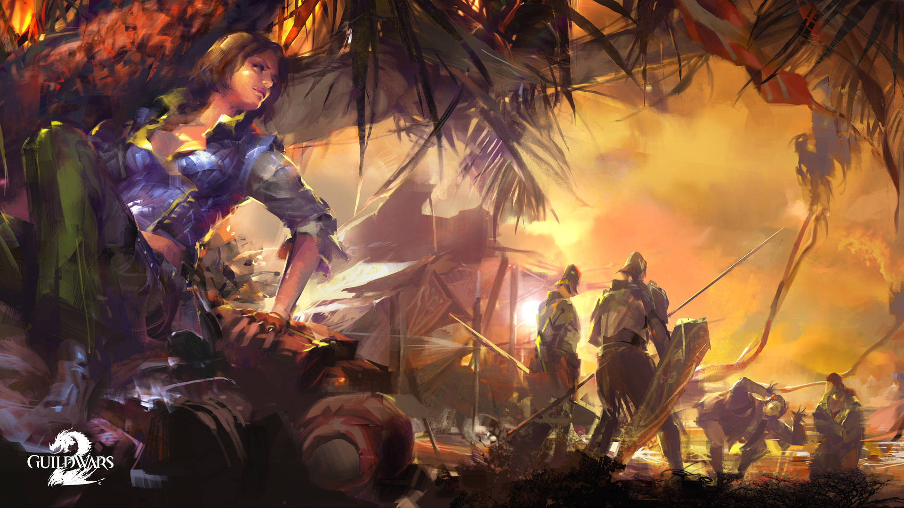
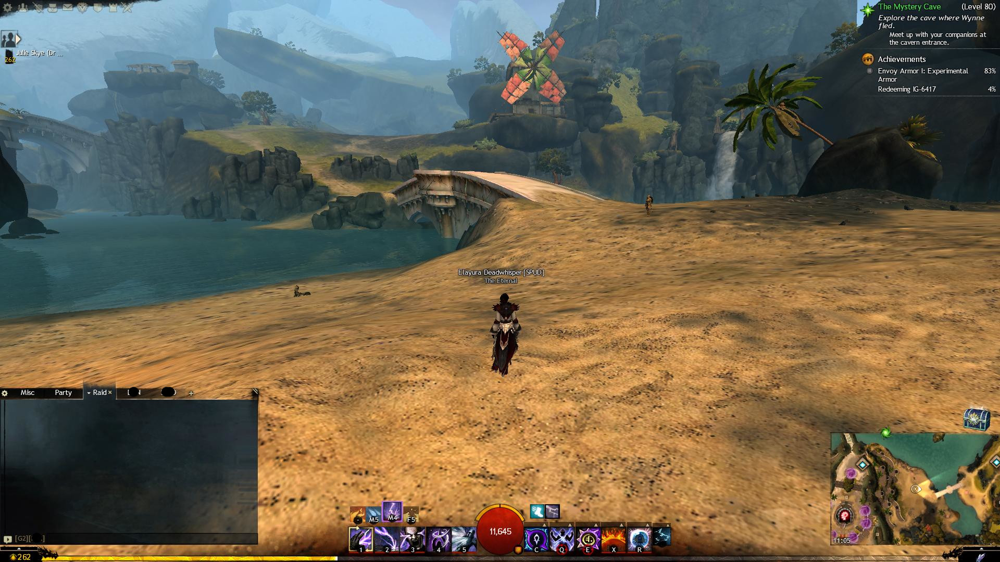
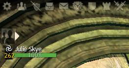
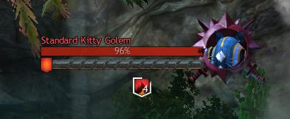
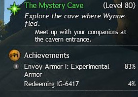
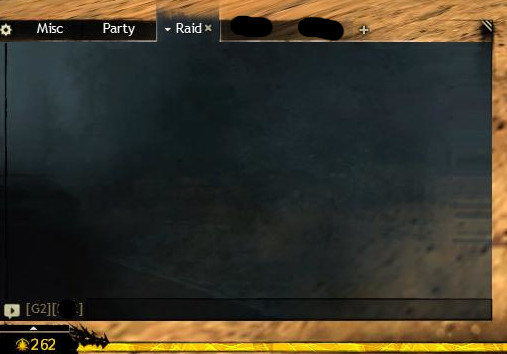
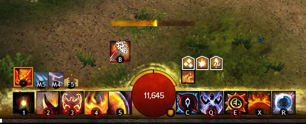
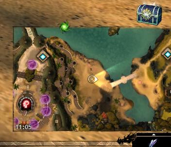
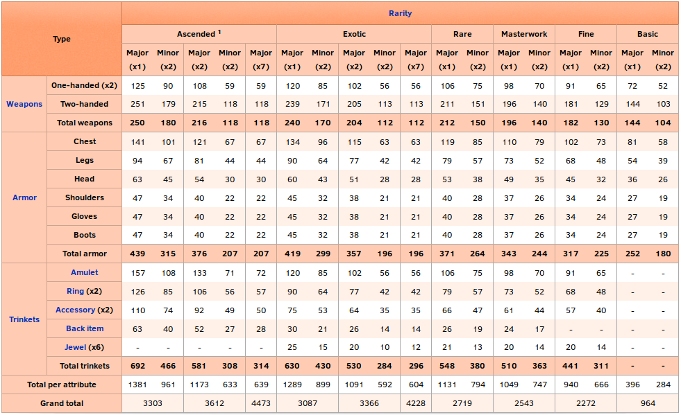

# Guild Wars 2 new Player Tutorial

By the community, for the community.

> If you want to contribute to this tutorial head over to https://github.com/Rkoturdo-Ndo/GW2-Tutorial. Whether it is just raising awareness of issues or actually contributing text, everything is welcome.

[TOC]

------

# Chapter 0: Basic Terminology

- If numbers are used the base value for level 80 and or the rarity exotic is used. Other level or rarity gear/skills have different numbers.
- CC means Crowd-Control. Generally that refers to skills that in some way restrict the control an enemy has over his character.
- ​

## 0.1 Races

> It is no problem for new players that want to play together to get different races, since the first way point in every starting region is unlocked for every player from the beginning. 
> This enables new players to play with their friends even if they have just free to play accounts.

### 0.1.1 Norn

The Norn i don't actually know jack shit about besides that they are over sized humans that can transform into animals. Their main city is Hoelbrak, which they built after they were forced out of the north by the elder dragon Jormag.

### 0.1.2 Charr

The Charr are a feline race native to Tyria. 250 years ago they fought war against the humans to reclaim territories taken from them by the humans. Their main city in the game is the black citadel, built on the ruins of the old human kingdom of Ascalon.

### 0.1.3 Asura

The Asura are one of the older races. Though not native to the surface they were forced out of the underground by the elder dragon Primordus. They are best known for their intelligence, technological advantages and their inflated ego. Their main city is Rata Sum, built after they had to escape the underground.

### 0.1.4 Sylvari

The Sylvari are the youngest race of the planet, only having come to live ~25 years before the events of Guild Wars 2. Their main city is the Grove, where they all awaken from the dream to come into this world.

### 0.1.5 Humans

Humans are the only non-native race on the planet that the player can choose. While a thriving force on Tyria in the older times, they are only a shadow of their former glory and influence. Their capital City is Divinity's Reach, one of the last major human cities.

[To the top](#Guild Wars 2 new Player Tutorial)

---

# Chapter 1: The User Interface

## 1.1 General Interface 

The user interface can be separated into different areas on the screen. Generally there is not that much interface customization possible unless you are willing to modify the game, which of course would be at your own risk and is not supported by ArenaNet.

**Top left**

In the top left of the User Interface you can find your party, showing health as well as boons and conditions. Over that there are different buttons to open parts of the Interface. From the left to the right:

Settings | Friends | Hero-Panel | Inventory | Mail | Trading-Post | Guilds | World vs. World | PvP

**Top center**

In the top center it shows information about your currently targeted enemy. This consists of healthbar, name, icon, [breakbar](#3.x: Break-bars and Crowd Control) (if existent) as well as boons and conditions.

**Top right**

In the top right you can find your content guide. It shows you your current mission, current events in your area, where to go for the next mission or piece needed for map completion. Besides that it can also show achievements you currently track.

**Bottom left**

In the bottom left the chat is displayed. Under that you can see your current level. You can edit the amount of tabs the chat has, what is displayed in each tab, if the chat is transparent or not as well as other things.

**Bottom Center**

In the bottom center is the most important part of the user interface. It shows your health (red bubble) as well as your endurance (orange bars over the bubble). Besides that it shows you your skills and their cooldown and current boons and conditions that might apply to you. A bit over that you see the casting-bar. It shows how far you are in casting your current spell/attack.

**Bottom right**

In the bottom right you can see your map. Under the map you can see the next reward for leveling up (you even "level up" when reaching maximum level, giving you another reward). Over the map the game shows rewards you earned. This can be login chests (as seen in the picture), rewards for completing quests as well as other things.

## 1.2 Menus

[To the top](#Guild Wars 2 new Player Tutorial)

---

# Chapter 2: Movement, Camera and Targeting

## 2.1 Movement

## 2.2 Tab Targeting

## 2.3 Action Cam

## 2.4 Other

[To the top](#Guild Wars 2 new Player Tutorial)

---
# Chapter 3: Combat

- basics
- levelcap for maps
- dodging
- combofields
- conditions
- weak trinity

## 3.x: Boons and Conditions

Most status effects in the game come in the way of boons or conditions. Boons is the term for positive effects, Condition for negative. They can either stack intensity, meaning that when the same is applied again the effect gets stronger, or they can stack duration, meaning when the same is applied the time is increased.

**Boons:**

- **Regeneration**: Regenerate health over timer, stacks duration
- **Stability**: While you have stability you can't be hard CCed, stacks intensity
- **Might**: Gain Power and Condition-damage, stacks intensity
- **Fury**: 20% critical hit chance, stacks duration
- **Aegis**: block the next attack, stacks duration
- **Resistance**: be unaffected by conditions, stacks duration
- **Alacrity**: reduces the skill recharge time by 33%, stacks duration
- **Swiftness**: move 33% faster, stacks duration
- **Quickness**: execute skills 33% faster, stacks duration

**Conditions:**

- Damaging Conditions, stacking Intensity

  - **Burn**: damage
  - **Poison**: damage and reduce received healing
  - **Confusion**: damage and extra damage on skill activation
  - **Torment**: damage and extra damage while moving
  - **Bleeding**: damage

- Crowd Control Conditions, stacking duration

  > See the chapter over Crowd Control

  - **Chill**: the targets movement speed and skill recharge speed are reduced by 66%
  - **Cripple**: the targets movement speed is reduced by 50%
  - **Immobilize**: the target is unable to move but can execute skills
  - **Weakness**: reduces the targets *endurance* regeneration and a 50% chance that hits are glancing blows, dealing 50% less damage
  - **Blindness**: the next attack misses

## 3.x: Combofields

There are different types of fields and finishers. When a finisher is activated inside a Combofield a special Interaction happens depending on the type of field and finisher. Whether or not a particular skill as a field or a finisher can be seen by hovering over them and reading the description.

- Blasts have an AoE effect
- Leaps only affect yourself
- Projectiles gain an additional effect, usually applying a boon or condition
- Whirls create projectiles with the additional effect

| Field         | Blast Finisher (AoE) | Leap Finisher | Projectile Finisher | Whirl Finisher            |
| ------------- | -------------------- | ------------- | ------------------- | ------------------------- |
| **Dark**      | blind enemies (AoE)  | blind enemies | Steal life          | Lifestealing Projectiles  |
| **Ethereal**  | Chaos Aura (AoE)     | Chaos Aura    | Confusion           | Confusion Projectiles     |
| **Fire**      | Might (AoE)          | Fire Aura     | Burning             | Burning Projectiles       |
| **Ice**       | Frost Aura(AoE)      | Frost Aura    | Chilled             | Chilling Projectiles      |
| **Light**     | Clean Condition(AoE) | Light Aura    | Remove Condition    | Cleansing Projectiles     |
| **Lightning** | Swiftness (AoE)      | Daze          | Vulnerability       | Vulnerability Projectiles |
| **Poison**    | Weakness (AoE)       | Weakness      | Poision             | Poisoning Projectiles     |
| **Smoke**     | Invisibility (AoE)   | Invisibility  | Blindness           | Blinding Projectiles      |
| **Water**     | Healing (AoE)        | Healing       | Regeneration        | Healing Projectiles       |

## 3.x: Break-bars and Crowd Control

When playing the game you will sometimes encounter enemies that have a blue bar below their healhbar. This indicates that the champion can not be stunned instantly. It is needed to reduce that bar to 0%, at wich point it slowly regenerates.

To remove the bar players need to use Crowd-Control abilities (alias CC). There are different types of CC and  you can see if a skill inflicts CC by reading the description.

**Hard CC:**

Hard CCs do more damage to breakbars, but can be avoided with stability. If the target possesss stability 1 stack of it gets remove instead of the effect of the CC activating.

- **Stuns**: the target is unable to move or use skills
- **Daze**: the target is able to move but unable to use skills
- **Float**: another form of stun
- **Knockdown**: another form of stun
- **Push/Pull**: the target is moved from its current position and unable to use skills/move on its own
- **Fear**: the target runs away from you unable to move on their own or use skills

**Soft CC:**

Soft CCs do less damage to break-bars and are not as severe as hard CCs, however they can not be countered by *stability* but instead are countered by *resistance*.

> Note: Fear is special in the sense that it gets countered by stability as well as resistance and aegis.

- **Chill**: the targets movement speed and skill recharge speed are reduced by 66%
- **Cripple**: the targets movement speed is reduced by 50%
- **Immobilize**: the target is unable to move but can execute skills
- **Weakness**: reduces the targets *endurance* regeneration and a 50% chance that hits are glancing blows, dealing 50% less damage
- **Blindness**: the next attack misses

[To the top](#Guild Wars 2 new Player Tutorial)

---
# Chapter 4: Classes

## 4.1: Heavy Armor (Soldier)

Soldier classes have the highest base armor in the game, coming in at  **1211** armor.

## 4.2: Medium Armor (Adventurer)

Adventurer classes have the middle amount of armor, coming in at **1064** armor.

## 4.3: Light Armor (Scholar)

Scholar classes have the least armor in the game, coming in at **920** armor.

## 4.3.1: Elementalist

- core
- tempest
- weaver

[To the top](#Guild Wars 2 new Player Tutorial)

---

# Chapter 5: Equipment

## 5.1 Attribute Combinations

Equipment differentiates in the bonuses it provides. Generally any armor/weapon has either 3 or 4 attributes.that it gives. On lower level equipment it is however normal to only get one or two stats from it. One exclusion from that is the divine attribute combination, which provides 7 attributes. Depending on the rarity and type of equipment the amount of stats differs.

### 5.1.2 Primary attributes

There are 4 primary attributes. These are the only ones that a character by himself has. At level 80 they they all have the baseline of 1000. Every other attribute has a baseline of 0.

**Offensive**

- **Power**: Increases outgoing direct damage
- **Precision**: Increases critical hit chance

**Defensive**

- **Toughness**: Increases armor
- **Vitality**: Increases health

###5.1.3 Secondary attributes

There are 5 secondary attributes. These have no baseline and can only be aquired over equipment, boons and buffs.

**Offensive**

- **Condition Damage**: Increases damage done by inflicting conditions
- **Expertise**: Increases duration of conditions
- **Ferocity**: Increases critical hit damage

**Defensive**

- **Concentration**: Increases duration of boons
- **Healing power**: Increases all outgoing healing

### 5.1.4 Derived attributes

There are 6 derived attributes, which are calculated from a corresponding primary attribute

- **Armor**: Increased by Toughness and Defense, reduces incoming direct damage
- **Boon Duration**: Increases duration of boons, 1% per 15 Concentration
- **Critical Chance**: Increases critical hit chance, 1% per 21 Precision
- **Critical Damage**: Increases critical hit damage, 1% per 150 Ferocity
- **Condition Duration**: Increases duration of all inflicted conditions, 1% per 15 Expertise
- **Health**: Maximum health, depends on profession, 10 Health per 1 Vitality

To read more on the topic of attribute combinations check out the [wiki](https://wiki.guildwars2.com/wiki/Attribute_combinations). That is also where the awesome table comes from.

## 5.2 Rarities

In typical MMO fashion equipment and drops are separated by rarity. Legendary equipment always has the same stats as the highest rarity available for the particular equipment type (usually ascended).

| Rarity Name    | Color  | Levels available | Relative stats | Improvement |
| -------------- | ------ | ---------------- | -------------- | ----------- |
| **Junk**       | Grey   | N/A              | N/A            | N/A         |
| **Basic**      | White  | 1-80             | 100%           | N/A         |
| **Fine**       | Blue   | 1-80             | 125%           | 25%         |
| **Masterwork** | Green  | 14-80            | 135%           | 8%          |
| **Rare**       | Yellow | 30-80            | 145%           | 7%          |
| **Exotic**     | Orange | 62-80            | 165%           | 14%         |
| **Ascended**   | Pink   | 80               | 175%           | 6%          |
| **Legendary**  | Purple | 80               | 175%           | 0%          |

## 5.3 Runes

Runes are used to increase the usefulness of armor. Each piece of armor has one rune slot, meaning in total you can equip 6 runes. The more of the same rune you stack the stronger the effect becomes. On lower levels this is capped to 2 stacks, on higher levels it goes up to 6. There are many different runes, ranging from providing simple stat boosts to having on hit effects or effects that are triggered by health thresholds. 

## 5.4 Sigils

Sigils are used to increase the usefulness of weapons. One-handed weapons have one sigil slot, two-handed weapons two. You can **NOT** stack sigils in order to increase their usefulness. As with runes their effects have a wide range.

## 5.5 Consumables

There are two different types of consumables in Guild Wars 2. One being food, the other being Enhancements. They can be applied at the same time, however only one of each type. Meaning that if you eat food the current foodbuff gets replaced with a new one. 
They usually grant passive stats like ferocity, boonduration or similar. Move information about consumables can be found on the [wiki](https://wiki.guildwars2.com/wiki/Consumable).

[To the top](#Guild Wars 2 new Player Tutorial)

---
# Chapter 6: Gamemodes

## 6.1: PvP

- How builds work
- how gamemodes work
- how progression works
- how seasons work

## 6.2: WvW

- i ain't know shit about WvW, sorry

## 6.3: PvE

### 6.3.1 Living World and Expansions

[To the top](#Guild Wars 2 new Player Tutorial)

---

# Chapter 7: Social

## 7.1: LFG

## 7.2: Guilds

[To the top](#Guild Wars 2 new Player Tutorial)

---
# Chapter 8: End Game Content

## 8.1 Fractals of the Mist (FotM)

The fractals of the mist are 5 party instances that act like mini-dungeons. The have a unique mechanic called agony. There are currently 18 different fractals and 100 fractal levels. Higher levels are harder and require agony-resistance, but also grant more rewards. For the lower levels no special equipment is needed, in order to get agony-resistance however one has to acquire [ascended armor](#5.2 Rarities).

## 8.2 Dungeons

## 8.3 Raids

## 8.4 Fashion Wars

## 8.5 PVP

## 8.6 WvW

[To the top](#Guild Wars 2 new Player Tutorial)

---
# Chapter 9: Other

## 9.1: Inventory Management

## 9.2: Crafting

## 9.3: Questing

## 9.4: Chat commands

## 9.5: Heart of Thorns

## 9.6: Path of Fire
[To the top](#Guild Wars 2 new Player Tutorial)

---

# Chapter 10: Further Resources

**GW2Efficency**

Gw2Efficency is a webside wich can be used to calculate crafting recipes, check out stats about your account, see information about the economy and many more things.

[Find it here](http://www.gw2efficency.com)

------

**Metabattle**

Metabattle is THE side for the builds currently beeing considered the best in PvP, PvE and WvW.

[Find it here](http://www.metabattle.com)

------

**dulfy.net**
Dulfy contains many guides for achievements as well as basic tutorials about Raids, Fractals, Dungeons and more.

[Find it here](http://www.dulfy.net)

------

**Reddit**

The Guild Wars 2 subreddit is arguably one of the biggest online communities for Guild Wars 2.

[Find it here](http://www.reddit.com/r/guildwars2)

------

**Happy Raiders Kit**

The Happy Raider's Kit is a document containing information on how to best get into raids.

[Find it here](https://docs.google.com/document/d/1g7zlH3pVPvW21WIh5-qL-IXDeABtJzIqnZYXP8tCcM0/edit#heading=h.2s8eyo1)

> Note that raids are end game content and if you are just starting the game it will take a while to get there. The fastest recorded time to get raid ready from a zero account (with planning and knowledge)  was roughly 42 hours of gametime. This was achieved by [WoodenPotatoes](www.youtube.com/user/WoodenPotatoes).

[To the top](#Guild Wars 2 new Player Tutorial)

---

