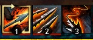
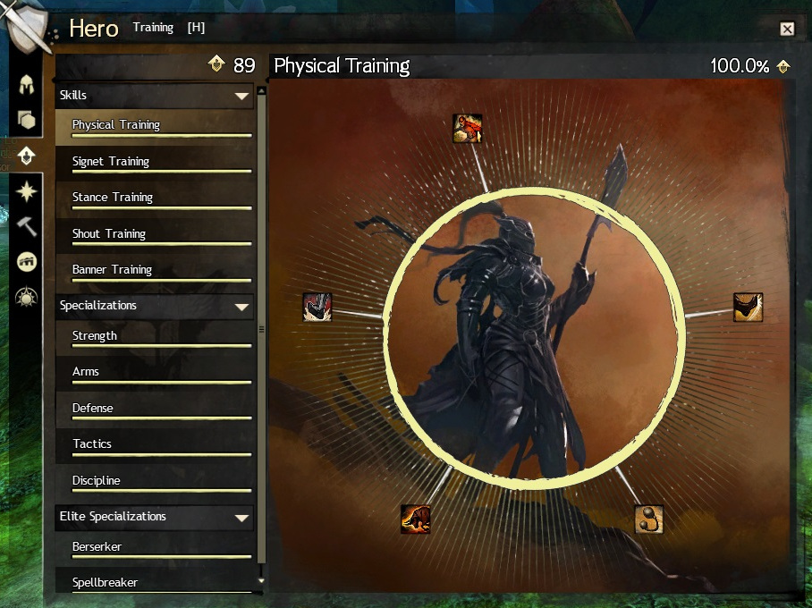

# Guild Wars 2 new Player Tutorial

By the community, for the community.

> If you want to contribute to this tutorial head over to https://github.com/Rkoturdo-Ndo/GW2-Tutorial. Whether it is just raising awareness of issues or actually contributing text, everything is welcome.

**Though you certainly can and I encourage it, this is not necessarily needed to be read from start to finish. Rather use it as a way to read about things when you are unsure. There is no use to overwhelm yourself with a wall of text :)**

[TOC]

------

# Chapter 0: Basic Terminology

- If numbers are used the base value for level 80 and or the rarity exotic is used. Other level or rarity gear/skills have different numbers.

- CC means [Crowd-Control](#3.x Break-bars and Crowd Control). Generally that refers to skills that in some way restrict the control an enemy has over his character.

- The game scales you down when visiting lower level areas, so don't think it is an issue to play with friends who are a lower level.

- You don't have to worry about griefing since you will get rewards for a mob for simply participating in the kill, even if you do not deliver the first, or the finishing blow.

- Because of how the game works there is no downtime on patchdays. Also the server selection only matters for world vs. world. If you are interested in the technical aspect, click [Here](http://www.gdcvault.com/play/1016640/Guild-Wars-2-Programming-the) to see a technical presentation by an engineer about how it works.

  > Guild Wars 1 has had about 24 hours of downtime so far in about 13 years.

## 0.1 Races

> It is no problem for new players that want to play together to get different races, since the first way point in every starting region is unlocked for every player from the beginning. 
> This enables new players to play with their friends even if they just have free to play accounts.

What race you choose only has an impact on the story of the game. While there are a few racial skills that are unique to them, they are designed to not be very strong, this is done so one race is not preferential over another.

### 0.1.1 The elder Dragons

The elder dragons are massive dragons that consume magic. After consuming magic they tend to sleep for millennials. In Guild Wars 2 they are awakening and destroying everything they touch with their primordial forces.

### 0.1.2 Norn

The Norn I don't actually know jack shit about besides that they are over sized humans that can transform into animals. Their main city is Hoelbrak, which they built after they were forced out of the north by the elder dragon Jormag.

### 0.1.3 Charr

The Charr are a feline race native to Tyria. 250 years ago they fought one of their final major offensives in the  war against the humans to reclaim territories taken from them. Their main city in the game is the black citadel, built on the ruins of the old human kingdom of Ascalon. Since the conflict is still going on relations are complicated between Humans and Charr.

### 0.1.4 Asura

The Asura are one of the older races. Though not native to the surface they were forced out of the underground by the elder dragon Primordus. They are best known for their intelligence, technological advantages and their inflated ego. Their main city is Rata Sum, built after they had to escape the underground.

### 0.1.5 Sylvari

The Sylvari are the youngest race of the planet, only having come to live ~25 years before the events of Guild Wars 2. Their main city is the Grove, where they all awaken from the dream, the mysterious stage of consciousness that they experience prior to their awakening, to come into this world.

### 0.1.6 Humans

Humans are the only non-native race on the planet that the player can choose. While a thriving force on Tyria in the older times, they are only a shadow of their former glory and influence. Their capital City is Divinity's Reach, one of the last major human cities.

[To the top](#Guild Wars 2 new Player Tutorial)

---

# Chapter 1: The User Interface

## 1.1 General Interface 

The user interface can be separated into different areas on the screen. Generally, there is not much interface customization possible. 

**Top left**

In the top left of the User Interface you can find your party, showing health as well as  [Boons and Conditions](#3.x Boons and Conditions) (positive and negative effects on a character). Over that there are different buttons to open parts of the Interface. From the left to the right:

Settings | Friends / LFG | Hero-Panel | Inventory | Mail | Trading-Post | Guilds | World vs. World | PvP

**Top center**

In the top center it shows information about your currently targeted entity. This consists of a healthbar, name, icon, [breakbar](#3.x: Break-bars and Crowd Control) (if existent) as well as boons and conditions. Below that extra information about them might be displayed.

**Top right**

In the top right you can find your content guide. It shows you your current mission, current events in your area, where to go for the next mission or piece needed for map completion. Besides that it can also show achievements you currently track.

**Bottom left**

In the bottom left the chat is displayed. Under that you can see your current level. You can edit the amount of tabs the chat has, what is displayed in each tab, if the chat is transparent or not as well as other things. In the Chapter [Chat-Commands](#9.5 Chat Commands) I will introduce you to the things about the chat you should know.

**Bottom Center**

In the bottom center is the most important part of the user interface. It shows your health (red bubble) as well as your endurance (orange bars over the bubble). Besides that it shows you your skills, skill cooldowns, current boons and current conditions. A bit over that you see the casting-bar. It shows how far you are in casting your current spell/attack.

> A red bar under a skill indicates whether the enemy is in range or not.
>
> 

Also you can see if your equipment is damaged or broken by the small orange/red shield on the bottom right of the health bubble.

While out of combat you can also swap out your skills on the right side of the bar by right-clicking or using the little arrow above them.

**Bottom right**

In the bottom right you can see your map. Under the map you can see the next reward for leveling up (you even "level up" when reaching maximum level, giving you another reward). Over the map the game shows rewards you earned. This can be login chests (as seen in the picture), rewards for completing quests, Events, and some other in game content.

> If you are to lazy to open all the chest to get them away you can simply right-click to instantly put the reward into your inventory.

## 1.2 The Map

The world map is your bread and butter for exploring. It shows events around you, hearts, Heropoints, points of interest(POIs) and whatever else you might need to know. You open the Map by pressing **M**.

In the top left it shows you your progress for world completion. Below that it shows what you still have to do on the current map to complete it. Completing a map gives you a special reward.

If you can't finding something you can hover over the respecting icon on the left to let the map highlight the positions.

[To the top](#Guild Wars 2 new Player Tutorial)

---

# Chapter 2: Movement, Camera and Targeting

## 2.1 Movement

Guild Wars utilizes the standard WASD movement. However, in order to be most effective in combat there are two things you have to keep in mind. The first one is dodging. It grants you a small time frame in which you evade all incoming attack. It will be your bread and butter for surviving. The other thing is jumping. Many bosses will have attacks that you can actually jump over in order to not be hit.	

Generally you can and should be moving while casting your abilities, there are however some skills that lock you in place.

## 2.2 Tab Targeting

Initially the game only utilized the well known tab targeting. It means your mouse is not locked to the middle of the screen and you can place your abilities and target enemies freely. If you have played World of Warcraft or other MMOs you will feel right at home.

## 2.3 Action Cam

For people that prefer the TERA style of gameplay there is also an action mode. It is a bit hidden, to activate it you must go to your keybindings, bind the "activate action cam" key and press it once you start the game. When "Action Cam" is enabled you will have a reticle in the middle of your screen. All skills will be cast at that position and you can simply leftclick to autoattack. 

Personally I highly recommend trying it out ;)

## 2.4 Other

[To the top](#Guild Wars 2 new Player Tutorial)

---
# Chapter 3: Combat

- Basics
- Levelcap for maps
- Dodging
- Combofields
- Conditions
- Weak trinity

## 3.x Weapons

The first five skills on your skill bar come from the weapon or wepons you have equipped (Dual Wield). Once you reach level ten you will be able to swap between two weapon sets.

## 3.x Boons and Conditions

Most status effects in the game come in the way of "Boons" or "Conditions". "Boons" refer to positive effects (Buffs), "Conditions" refer to negetive effects (Debuffs). They can either stack intensity, which makes the effect stronger Or they can stack duration, which makes the effect last longer.

**Boons:**

- Stacking intensity
  - **Stability**: While you have stability you can't be hard CCed, stacks intensity
  - **Might**: Gain Power and Condition-damage, stacks intensity

- Stacking duration
  - **Fury**: 20% critical hit chance, stacks duration
  - **Regeneration**: Regenerate health over timer, stacks duration
  - **Aegis**: block the next attack, stacks duration
  - **Resistance**: be unaffected by conditions, stacks duration
  - **Alacrity**: reduces the skill recharge time by 33%, stacks duration
  - **Swiftness**: move 33% faster, stacks duration
  - **Quickness**: execute skills 33% faster, stacks duration
  - **Vigor**: Increase endurance regeneration by 50%
  - **Protection**: Reduce incoming physical damage by 33%
  - **Retaliation**: Reflect damage back to enemies

**Conditions:**

- Damaging Conditions, stacking Intensity

  - **Burn**: damage
  - **Poison**: damage and reduce received healing
  - **Confusion**: damage and extra damage on skill activation
  - **Torment**: damage and extra damage while moving
  - **Bleeding**: damage

- Crowd Control Conditions, stacking duration

  > See the chapter over Crowd Control

  - **Chill**: the targets movement speed and skill recharge speed are reduced by 66%
  - **Cripple**: the targets movement speed is reduced by 50%
  - **Immobilize**: the target is unable to move but can execute skills
  - **Weakness**: reduces the targets *endurance* regeneration and a 50% chance that hits are glancing blows, dealing 50% less damage
  - **Blindness**: the next attack misses

## 3.x Combofields

There are different types of fields and finishers. When a finisher is activated inside a Combofield a special Interaction happens depending on the type of field and finisher. Whether or not a particular skill as a field or a finisher can be seen by hovering over them and reading the description.

- Blasts have an AoE effect
- Leaps only affect yourself
- Projectiles gain an additional effect, usually applying a boon or condition
- Whirls create projectiles with the additional effect

| Field         | Blast Finisher (AoE) | Leap Finisher | Projectile Finisher | Whirl Finisher            |
| ------------- | -------------------- | ------------- | ------------------- | ------------------------- |
| **Dark**      | blind enemies (AoE)  | blind enemies | Steal life          | Lifestealing Projectiles  |
| **Ethereal**  | Chaos Aura (AoE)     | Chaos Aura    | Confusion           | Confusion Projectiles     |
| **Fire**      | Might (AoE)          | Fire Aura     | Burning             | Burning Projectiles       |
| **Ice**       | Frost Aura(AoE)      | Frost Aura    | Chilled             | Chilling Projectiles      |
| **Light**     | Clean Condition(AoE) | Light Aura    | Remove Condition    | Cleansing Projectiles     |
| **Lightning** | Swiftness (AoE)      | Daze          | Vulnerability       | Vulnerability Projectiles |
| **Poison**    | Weakness (AoE)       | Weakness      | Poision             | Poisoning Projectiles     |
| **Smoke**     | Invisibility (AoE)   | Invisibility  | Blindness           | Blinding Projectiles      |
| **Water**     | Healing (AoE)        | Healing       | Regeneration        | Healing Projectiles       |

## 3.x Break-bars and Crowd Control

When playing the game you will sometimes encounter enemies that have a blue bar below their health. This is a "Break-bar" and protects the foe from crowd control effects. Using Crowd-Control abilities (alias CC) You can reduce this bar to 0, when this is complete the bar will begin to slowly regenerate and the foe will often become dazed and take increased damage. Break-bars are an important aspect to combat and should be broken as soon as the bar is filled again.

To remove the bar players need to use Crowd-Control abilities (alias CC). There are different types of CC and you can see if a skill inflicts CC by reading the description.

**Hard CC:**

Hard CCs do more damage to breakbars, but can be avoided with stability. If the target possesses stability 1 stack of it gets removed instead of the effect of the CC activating.

- **Stuns**: the target is unable to move or use skills
- **Daze**: the target is able to move but unable to use skills
- **Float**: another form of stun
- **Knockdown**: another form of stun
- **Push/Pull**: the target is moved from its current position and unable to use skills/move on its own

**Soft CC:**

Soft CCs do less damage to break-bars and are not as severe as hard CCs, however they can not be countered by *stability* but instead are countered by *resistance*.

> Note: Fear is special in that it gets countered by stability as well as resistance and aegis.

- **Chill**: the targets movement speed and skill recharge speed are reduced by 66%
- **Cripple**: the targets movement speed is reduced by 50%
- **Immobilize**: the target is unable to move but can execute skills
- **Weakness**: reduces the targets *endurance* regeneration and a 50% chance that hits are glancing blows, dealing 50% less damage
- **Blindness**: the next attack misses
- **Fear**: the target runs away from you unable to move on their own or use skills

[To the top](#Guild Wars 2 new Player Tutorial)

---
# Chapter 4: Professions

## 4.1 (Professions) Armor

Professions come in three armor classes.

|            Class             |           Profession              |   Armor Rating  |
|------------------------------|-----------------------------------|-----------------|
| Heavy Armor (Soldiers)       | Guardian, Revenant, Warrior       |     **1211**    |
| Medium Armor (Adventurers)   | Engineer, Ranger, Thief           |     **1064**    |
| Light Armor (Scholars)       | Elementalist, Mesmer, Necromancer |     **920**     |

## 4.2 (Professions) Health

Professions come in three health pools. These pools are added on the base health (10,000 at level 80).

| Base health gained per level         |  1-19  |  20-39 | 40-59 | 60-79 |  80   | Total at level 80 |
| -------------------------------------|--------|--------|-------|-------|-------|-------------------|
| Warrior, Necromancer                 |   28   |   70   |  140  |  210  |  280  |       9,212       |
| Revenant, Engineer, Ranger, Mesmer   |   18   |   45   |  90   |  135  |  180  |       5,922       |
| Guardian, Thief, Elementalist        |   5    |  12.5  |  25   |  37.5 |  50   |       1,645       |

## 4.3 (Professions) Soldiers

## 4.3.1 Guardian

 - Core
 - Dragonhunter
 - Firebrand

## 4.3.2 Revenant

- Core
- Herald
- Renegade

## 4.3.3 Warrior

- Core
- Berserker
- Spellbreaker

## 4.4 (Professions) Adventurers

## 4.4.1 Engineer

- Core
- Scrapper
- Holosmith

## 4.4.2 Ranger

- Core
- Druid
- Soulbeast

## 4.4.3 Thief

- Core
- Daredevil
- Deadeye

## 4.5 (Professions) Scholars

## 4.5.1 Elementalist

- Core
- Tempest
- Weaver

## 4.5.2 Mesmer

- Core
- Chronomancer
- Mirage

## 4.5.3 Necromancer

- Core
- Reaper
- Scourge

[To the top](#Guild Wars 2 new Player Tutorial)

---

# Chapter 5: Equipment

## 5.1 Attribute Combinations

Equipment differentiates in the bonuses it provides. Generally any armor/weapon has either 3 or 4 attributes.that it gives. On lower level equipment it is however normal to only get one or two stats from it. One exclusion from that is the celestial attribute combination, which provides 7 attributes. Depending on the rarity and type of equipment the amount of stats differs.

### 5.1.2 Primary attributes

There are four primary attributes. These are the only ones that a character without equipment will have. At level 80 they all have the baseline of 1000. Every other attribute has a baseline of 0.

**Offensive**

- **Power**: Increases outgoing direct damage
- **Precision**: Increases critical hit chance

**Defensive**

- **Toughness**: Increases armor
- **Vitality**: Increases health

###5.1.3 Secondary attributes

There are 5 secondary attributes. These have no baseline and can only be aquired through equipment, boons and buffs.

**Offensive**

- **Condition Damage**: Increases damage done by inflicting conditions
- **Expertise**: Increases duration of conditions
- **Ferocity**: Increases critical hit damage

**Defensive**

- **Concentration**: Increases duration of boons
- **Healing power**: Increases all outgoing healing

### 5.1.4 Derived attributes

There are 6 derived attributes, which are calculated from a corresponding primary attribute

- **Armor**: Increased by Toughness and Defense, reduces incoming direct damage
- **Boon Duration**: Increases duration of boons, 1% per 15 Concentration
- **Critical Chance**: Increases critical hit chance, 1% per 21 Precision
- **Critical Damage**: Increases critical hit damage, 1% per 150 Ferocity
- **Condition Duration**: Increases duration of all inflicted conditions, 1% per 15 Expertise
- **Health**: Maximum health, depends on profession, 10 Health per 1 Vitality

To read more on the topic of attribute combinations check out the [wiki](https://wiki.guildwars2.com/wiki/Attribute_combinations). That is also where the awesome table comes from.

## 5.2 Rarities

In typical MMO fashion equipment and drops are separated by rarity. Legendary equipment always has the same stats as the highest rarity available for the particular equipment type (usually ascended).

| Rarity Name    | Color  | Levels available | Relative stats | Improvement |
| -------------- | ------ | ---------------- | -------------- | ----------- |
| **Junk**       | Grey   | N/A              | N/A            | N/A         |
| **Basic**      | White  | 1-80             | 100%           | N/A         |
| **Fine**       | Blue   | 1-80             | 125%           | 25%         |
| **Masterwork** | Green  | 14-80            | 135%           | 8%          |
| **Rare**       | Yellow | 30-80            | 145%           | 7%          |
| **Exotic**     | Orange | 62-80            | 165%           | 14%         |
| **Ascended**   | Pink   | 80               | 175%           | 6%          |
| **Legendary**  | Purple | 80               | 175%           | 0%          |

## 5.3 Runes

Runes are used to increase the usefulness of armor. Each piece of armor has one rune slot, allowing you to equip a total of six. The more of the same rune you stack the stronger the effect becomes. On lower levels this is capped at two stacks, on higher levels it goes up to six. There are many different runes, some offer defensive buffs, offensive buffs, or other effects.

## 5.4 Sigils

Sigils are used to increase the usefulness of weapons. One-handed weapons have one sigil slot, two-handed weapons have two. You can **NOT** use two of same sigil on the same weapon set. As with runes, Sigils have Defensive, Offensive, and other effects

## 5.5 Consumables

There are two different types of consumables in Guild Wars 2. One being food, the other being Enhancements. They can be applied at the same time, however only one of each type. this means eating food replaces any food buff you may have had.
They usually grant passive stats like ferocity, boon duration or similar. More information about consumables can be found on the [wiki](https://wiki.guildwars2.com/wiki/Consumable).

##5.6 Skins

Skins are a huge part of Guild Wars 2. When salvaging or equipping armor you unlock the skin of that particular piece. Later you can use a transmutation charge (basically a currency) to change the look of your equipment to already unlocked skins. Some skins are very prestigious while others are not. 

Heavy, medium and light armor have their own skins and can not be applied to each other. There are some cultural skins that can only be worn by one race.

> You find the option to reskin in your hero panel under "Wardrobe"

## 5.7 Accountbound / Souldbound /Unique

This is a rather important thing to know, so it deserves its own chapter. Equipment and other items can be one of three things.

**Accountbound**

Accountbound means that you can use it on any character on your account, even after equipping it. It does however restrict you from selling it to other players.

**Soulbound**

Souldbound goes a step further. Items that are soulbound can only be used by the character they are bound to.

**Unique**

Some items, especially ascended Rings and Accessories can be unique. This means that you can **only equip one item with the same name**. It is a  common mistake to buy two ascended rings that are the same and then wonder why you can't equip both. Read the description carefully :)

[To the top](#Guild Wars 2 new Player Tutorial)

---
# Chapter 6: Gamemodes

The game consists of three main gamemodes. While it is perfectly possible to play all three, they are very different and some players will gravitate to certain modes. If you find yourself disliking a particular mode you might try the others to see if they are more fun for you.

## 6.1: PvP

- How builds work
- how gamemodes work
- how progression works
- how seasons work

## 6.2: WvW

- I ain't know shit about WvW, sorry

## 6.3: PvE

## 6.3.1 Living World and Expansions

[To the top](#Guild Wars 2 new Player Tutorial)

---

# Chapter 7: Social

## 7.1: Looking For Group (LFG)

The LFG is the main way for you to find players to play with. For dungeons, casual roleplay, personal story or achievements, this is your go to way to find players.

It is separated into different categories. In order for you to jump into it, here is a short list of common abreveations used in the LFG:

**Taxi**
Because the game uses a mega server system there are often multiple instances of the same map. In order to get every player on the same map (for example to do a world boss) players might offer Taxis. Using a taxi is rather simple. Join the group and go to the map. If you happen to not be on the same instance (which you will see by the health bars not being shown in the top left) you can right-click on a name up there and use 

> join <mapname>

- **p1 / p2 / p3** : This is a term commonly used when doing dungeons. It refers to which of the explorable paths the group intends to clear.
- **KP**: KP means kill-proof. For raids or high level fractals players sometimes demand kill proofs to know that the player joining has some experience with the content.
- ​

## 7.2: Guilds

[To the top](#Guild Wars 2 new Player Tutorial)

---
# Chapter 8: End Game Content

## 8.1 Fractals of the Mist (FotM)

The fractals of the mist are five player instances that act like mini-dungeons. They have a unique mechanic called "Agony". There are currently 18 different fractals and 100 fractal levels. Higher levels are harder and require agony-resistance, but also grant more rewards. For the lower levels no special equipment is needed. In order to get agony-resistance [ascended armor](#5.2 Rarities) Is Required.

## 8.2 Dungeons

Dungeons are the oldest end game content in the game. They were present at the release of the game, and while not being as actively pursued as other contens they still are worthwhile for learning the game, getting equipment and a decent amount of money. There are 8 dungeons in the game. Each dungeon has one story path and three exploration paths (which are the ones being done for reward). One exception is the last one, which has five paths in total. Dungeons are five man content. Even though some of the dungeons have a lower recommended level they are actually decent level 80 content because of the scaling mechanism.

All dungeons offer unique skins as well as food and runes.

**Ascalonian Catacombs**: Level: 30-35

The Ascalonian Catacombs are the first dungeon you will be introduced to in the game. Go into the ancient Ascalonian Catacombs near the black citadel.

**Caudecus's Manner**: Level 40-45

Find out what mysteries lie in the Manner of Caudecus Beetlestone the Wise, Legate Minister of the Krytan Ministry, located in Beetletun near Divinitys Reach.

**Twilight Arbor**: Level 50-55 (80 for the Aetherpath)

Find out what the Nightmare Court is up to. Enter the twilight arbor and fight alongside Caithe in order to stop them. Twilight Arbor is located inside Caledon forest.

**Sorrow's Embrace**: Level 60-65

Enter the dredge city within the Shiverpeak Mountains to help Zojja finding her masters research. Fight the xenophobic dredge to advance.

**Citadel of Flame**: Level 70-75

Face the flame legion alongside the pact in order to stop Gaheron Baelfire, leader of the flame legion from pursuing godhood. Enter their temple in Fireheart Rise to stop them.

**Honor of the Waves**: Level 76-80

Explore the half sunken sanctuary of the kodan in the far north of Frostgorge Sound. Fight the ravaging Sons of Svanir as well as the icebrood and salvage the magical artifacts.

**Crucible of Eternity** Level 78-80

Break into the inquest research facility in Mount Maelstrom to pursue the Inquest and stop them from their horrible experiments.

**The Ruined city of Arah** Level 80-80

Enter the resurfaced sunken capital Arah of the ancient human kindgom of Orr. Fight against the undead in order to stop them from destroying all life.

## 8.3 Raids

Raids are the newest end game content in the game. They were first introduced with the Heart of Thorns expansion. In order to be able to play raids you need the Expansion in which they ship. There are currently five Raid wings. Raiding itself is a bit out of scope of this tutorial, so you might want to check out the [Happy Raiders Kit](https://docs.google.com/document/d/1g7zlH3pVPvW21WIh5-qL-IXDeABtJzIqnZYXP8tCcM0/edit#heading=h.2s8eyo1) if you intend to pursue them.

**Forsaken Thicket**

The Forsaken Thicket is the first Raid introduced into the Game. It is seperated into 3 Wings, the first of which was released a few weeks after the launch of Heart of Thorns.

**Spirit Vale** 

Spirit Vale is the first Wing of the Forsaken Thicket, consisting of 3 distinct bosses as well as events between them. Enter it to find out what happened to the lost Pact squad.

**Salvation Pass**

Salvation Pass is the second Wing. It also features 3 boss encounters. Venture deeper into the Thicket to save what you can of the squad.

**Stronghold of the Faithful**

The third wing of the first raid also features 3 boss encounters. The first one being an escort quest, the rest normal bosses. Enter the stronghold of the white mantle to stop them in their evil deeds.

**Bastion of the Penitent**

Bastion of the Penitent is the second Raid, consisting of a single Wing. Fight against 4 bosses in order to unveil its mysteries.

**Hall of Chains**
Hall of Chains is the newest Raid released and the only one not being part of Heart of Thorns. Venture into the underworld to find out what is happening in the realm of the dead.

## 8.4 Fashion Wars

A really big part of Guild Wars 2 is Fashion. The game has a rather complex skin system, you can read more about it in [chapter 5.6](#5.6 Skins). For many people the end goal in the game is to collect certain skins. Many are relatively easy to get, but the most prestigious ones take time and effort to acquire.

## 8.5 PVP

Personally I am not much of a PvP player, so this section is cut rather short. There is a league system in the game. PvP also offers reward tracks, meaning that you can select a track and every game you play gives you progress towards is, with loot at certain stages and a grand chest at the end. As well as that there is an automated tournament system with multiple tournaments per day and a really big monthly tournament. Winning that grants you a statue in the heart of the mists, the PvP lobby of the game. PvP offers to you acquire a unique legendary backpack.

One important note about PvP is that there is no gear grind. Stats are handled with amulets you can equip. While some of them have a small up front initial cost this enables the game to be fair balanced stat wise. Someone just joining has the same tools to win like an experienced player.

## 8.6 WvW

Similar to PvP I don't know much about WvW. World vs World is a massive scale PvP where servers fight against one another to seize control of 3 regions. Similar to PvP it offers reward tracks and has its own legendary backpack you can acquire.

Other than PvP a gear grind technically exists in WvW since it doesn't use amulets but the PvE weapons and armor you wear. This means that you have way more freedom in your builds, but at the same time have to take care of having decent equipment.

[To the top](#Guild Wars 2 new Player Tutorial)

---
# Chapter 9: Other

## 9.1 Questing

Questing in Guild Wars works very different to other games.

First, there is the personal story. These are story missions you get every 10 levels if you are under level 80 or just back to back if you play the expansion story / living world story.

For leveling you would usually quest in other MMOs or grind mobs. In guild wars there quests do not exist. However you will find hearts scattered around the map. These are basically locally bound quest that you automatically accept once you enter the area and halt once you leave it again. 

Another thing are hero points (yellow "arrows" on the map). They will give you hero points you can spend on leveling.

The third big thing are Events. These will be shown in orange on your map. They spawn randomly around the world and every player can participate.

> As you can see guild wars encourages you to explore the world to level. This also however means that there is no straight "direction" to start. You can visit the other starting areas and quest a bit there, or just play in yours.

## 9.2 Leveling

Leveling also works a bit different in Guildwars. When leveling up or completing hero points in the world you get hero points you can spend. If you open your character menu with H you can open a page where you can train your skills. 

The training is separated into active abilities (Skills) and passive traits (Specialitations). Passive traits can be used by equipping the entire traitline and selecting which ones to activate. You can only have up to 3 traitlines at the same time.

The active skills are what is put on the right side bar of your skills. Meaning the healskill to the ultimate skill.

> Do not worry to much about what traits and skills to level, you will be able to unlock them all.

Often one of the utility lines and one of the traitlines correspond to one another. When crafting a build try to get the best synergy.	

## 9.3 Inventory Management

Inventory management can be a huge part of MMOs. Guild Wars tries to make it as little painful as possible.  One of the unusual things you can do in GW is deposit all materials in your inventory to your material storage with one click.

On the bottom left you see a button that shows you your wallet. Meaning all the different currencies. On the bottom right you see gold and a currency relevant to the map if it exists, or karma otherwise.

The inventory size is determined by the amount and quality of bags (left row) you have. Bags go from 5 to 32 slots and you can have up to 8 bags. In the top most row you can see shared inventory slots, which are, as the name implies shared between all characters. They are pretty expensive but might be worth the hassle.

**Salvaging** 
Salvaging found equipment can be worth it in order to get materials out of them. For salvaging you will need salvage kits. If you don't want to click every single item salvage kits offer the option to salvage all of a specific type.

## 9.4 Crafting

## 9.5 Chat commands

Guild Wars 2 offers a plethora of chat commands. Some of them are purely for roleplaying, while others are convenience functions or offer you additional information.

**Communication**

- **/s** or /l to say, meaning that only people around you will hear
- **/g** to talk in the guild channel of your active (represented) guild. For other guilds use /g1 to /g5
- **/p** to talk in party chat.
- **/d** to talk in squadchat
- **/t** to talk in teamchat (PvP, WvW, Daily Activities)
- **/m** or /y to talk in mapchat
- **/w** to whisper someone in private
- **/r** to respond to someone in private
- **Backspace** to reply to the last whisper

**Pinging items**

- **CTRL + leftclick** to send a link to an item, skill, waypoint or point of interest
- **SHIFT + leftclick** to insert a link to an item, skill, waypoint or point of interest in your current message

**Groups**

-  **/invite** [name] - invite a player to join your party
- **/join** [name] - request to join a player's party
- **/leave** - leave your current party
- **/kick** [name] - vote to kick party member (requires a majority vote)
- **/resign** - Kill yourself. Can only be used in [raids](https://wiki.guildwars2.com/wiki/Raid) or [fractals](https://wiki.guildwars2.com/wiki/Fractal), allows squads or parties to concede defeat faster. (Also available as **/surrender**, **/concede**, **/forfeit**, **/ff**, **/qq** or **/gg**)
- **/squadjoin** [commander_name] - join a [commander](https://wiki.guildwars2.com/wiki/Commander)'s squad. (Also available as **/sqjoin**)
- **/squadleave** - leave your current squad. (Also available as **/sqleave**)
- **/squadinvite** - invite to squad. (Also available as **/sqinvite**)

**General**

- **/age** shows you the age of your character and account
- **/rank** — drop a banner that will display your current [PvP Rank](https://wiki.guildwars2.com/wiki/PvP_Rank), e.g. if you ranked rabbit it will show a rabbit on the banner and some hopping above.
- **/rank** <1-80> — drop a banner of a specific PvP Rank, no higher than your current rank.
- **/deaths** — displays the number of times your character has died, "*You have died <x> time(s).*"
- **/ip** — displays the IP address of the server.
- **/support** or **/bug** — opens the [support panel](https://wiki.guildwars2.com/wiki/Support_panel).
- **/stuck** — teleports the player to the beginning of the instance 
- **/wiki** opens the wiki in your default browser
- **/wiki** <keyword> searches the wiki for keyword. Can be combined with shift + leftclick to search for specific items

**Emotes**

For roleplaying Guild Wars 2 offers some emotes. The whole table can be found [here](https://wiki.guildwars2.com/wiki/Emote). 

## 9.6 Making Money

When starting a new MMO it can be hard to figure out how to best make money. While a full guide would not be in scope for this tutorial, here are a few quick tips how you can get a decent start.

- Do the daily completionist achievement. For it you have to complete 3 of the daily achievements. While that might be hard in the early early beginning it is a good way to get 2 gold per day for relatively little effort.
- Check if you can sell your loot over the trading post instead of selling it to merchants.
- Especially when new to the game it can be good to join dungeon runs. While they are not the most bang for the buck they offer a great learning experience with decent rewards.

### 9.6.1 Trading Post

The trading post is the main way for players to trade items, since there is **no** direct player to player trading. When selling an item there is a 15% tax. 5% of that have to be paid when listing the item, the other 10% will be deducted once the item is sold.

## 9.7 Options

The options menu offers quite a few options to customize how your game behaves. Here I will list some of the most important ones.

- **Content Guide**: This settings enables you to customize what your content guide (top right) shows

- **Ground Targeting**: ground targeting is a way to customize how your abilities are triggered. I personally recommend ground targeting with range indicator, but it is best to experiment
- **Double-Tap to Evade**: By default you can evade by doubletapping in a certain direction. **Disable it** and bind dodge to your mouse wheel. Trust me you will thank me later.
- **Melee Attack Assist**: This option prevents you from accidentally walking through an enemy when attacking. I would recommend turning it of as it prevents you from standing inside enemies.

[To the top](#Guild Wars 2 new Player Tutorial)

---

# Chapter 10: Expansions

## 10.1 Heart of Thorns

## 10.2 Path of Fire

[To the top](#Guild Wars 2 new Player Tutorial)

---

# Chapter 11: Further Resources

**GW2Efficiency**

Gw2Efficiency is a website which can be used to calculate crafting recipes, check out stats about your account, see information about the economy and many more things.

[Find it here](http://www.gw2efficiency.com)

------

**Metabattle**

Metabattle is THE site for the builds currently being considered the best in PvP, PvE and WvW.

[Find it here](http://www.metabattle.com)

------

**GODSofPvP**

Gods of PvP is a fairly new site (as far as I know) focused on builds and tutorials for PvP.

[Find it here](http://godsofpvp.net/)

---

**GW2crafts**

A side that calculates the best way to level your crafting profession.m

[Find it here](http://gw2crafts.net/)

---

**dulfy**

Dulfy writes  many guides for achievements as well as basic tutorials about Raids, Fractals, Dungeons and more.

[Find it here](http://www.dulfy.net)

------

**Reddit**

The Guild Wars 2 subreddit is arguably one of the biggest online communities for Guild Wars 2.

[Find it here](http://www.reddit.com/r/guildwars2)

------

**Guide to Movement and Combat**

A more in depth guide about how to move and fight.

[Find it here](https://whyigame.wordpress.com/the-beginners-guide-to-movement-in-combat-guild-wars-2/)

---

**Happy Raiders Kit**

The Happy Raider's Kit is a document containing information on how to best get into raids.

[Find it here](https://docs.google.com/document/d/1g7zlH3pVPvW21WIh5-qL-IXDeABtJzIqnZYXP8tCcM0/edit#heading=h.2s8eyo1)

> Note that raids are end game content and if you are just starting the game it will take a while to get there. The fastest recorded time to get raid ready from a zero account (with planning and knowledge)  was roughly 42 hours of gametime. This was achieved by [WoodenPotatoes](www.youtube.com/user/WoodenPotatoes). Realistically you will take way longer than that, having to learn the game aswell. 

[To the top](#Guild Wars 2 new Player Tutorial)

---

